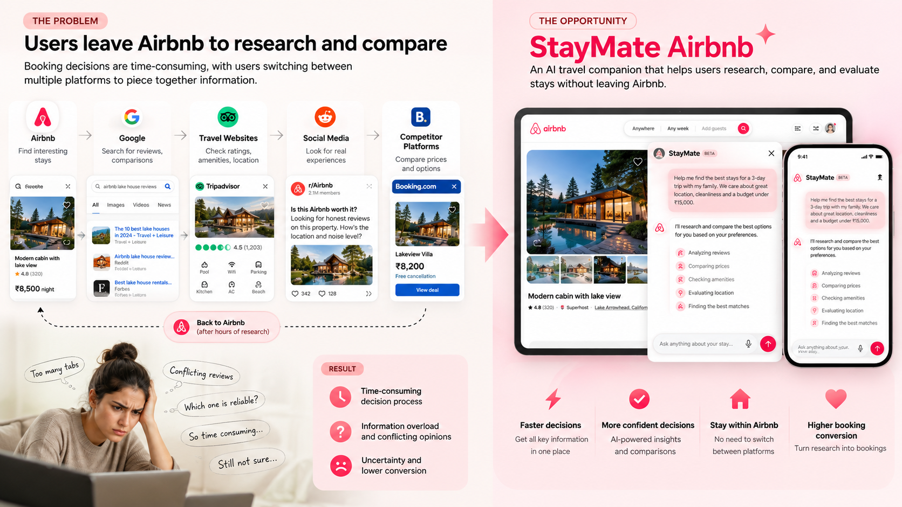
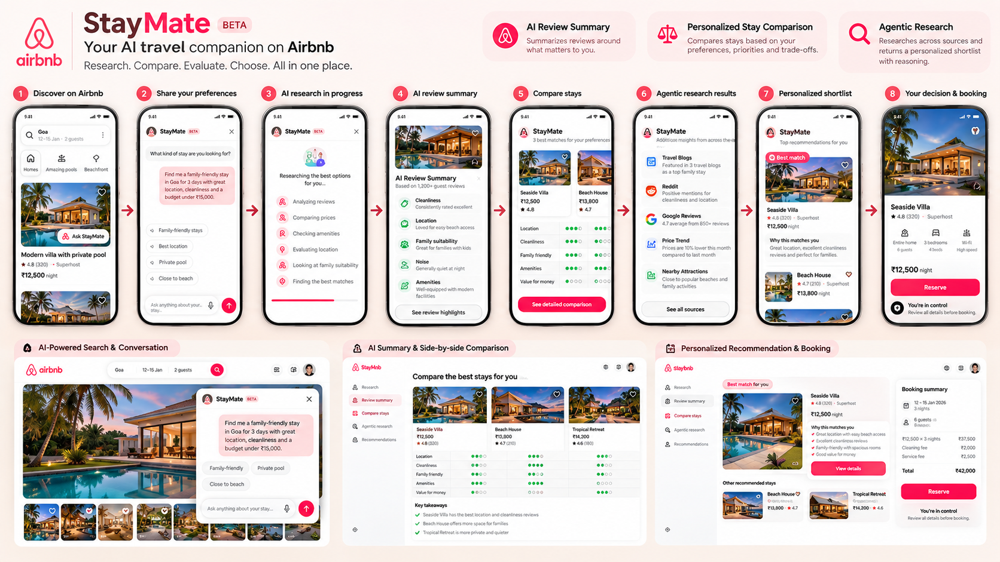
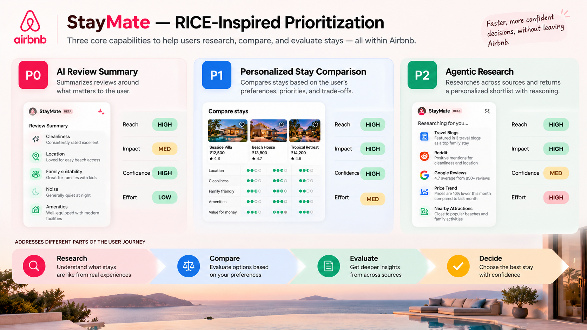
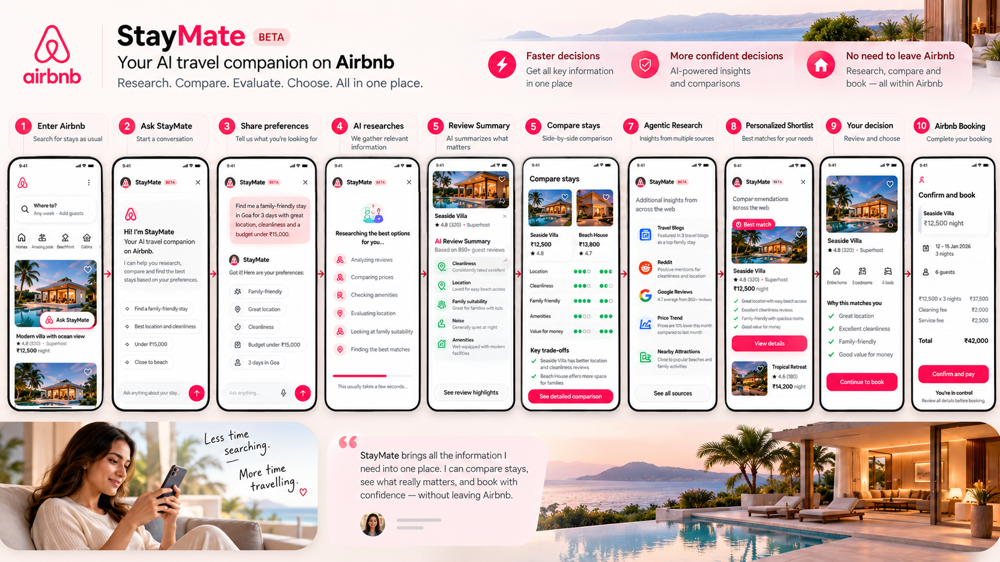

# StayMate x Airbnb — Portfolio Product Showcase

A polished product mockup and workflow prototype built from the workshop PRD and sample design screens. This repository is designed to feel like a portfolio-ready product case study for a product manager or frontend engineer working on travel, decision support, and customer experience experiences.

<p align="center">
  
  
  
  
</p>

## Portfolio summary
A product-driven travel experience concept focused on discovery, recommendation confidence, and decision support. This project translates a workshop PRD and design screen references into a polished front-end prototype that feels like a real SaaS product experience rather than a generic demo.

### Short portfolio blurb
> Built a portfolio-ready travel product concept that combines AI-assisted discovery, decision support, and comparison workflows into a polished, recruiter-friendly frontend prototype.

## Overview
This project brings together:

- the workshop PRD,
- the sample screen assets,
- and a modern portfolio presentation,

into a cohesive GitHub-ready project that demonstrates product thinking, UX exploration, and real-world workflow design.

The goal is to present a compelling product story for recruiters, hiring managers, and design/product stakeholders who want to see how ideas become tangible experiences.
# StayMate

<p align="center">
  <strong>An AI companion for choosing a stay with confidence.</strong><br />
  Product strategy · UX exploration · Responsive React showcase
</p>

<p align="center">
  <a href="https://stitch.withgoogle.com/projects/12556739218636411021">Stitch concept board</a> ·
  <a href="PRD.md">Product requirements</a> ·
  <a href="https://github.com/cuzimextra95-blip/Staymate-Airbnb">GitHub repository</a>
</p>

<p align="center">
  
</p>

## Overview

StayMate is a portfolio concept for an AI decision companion inside the Airbnb stay-discovery journey. It helps guests understand reviews, compare a shortlist against their own priorities, and explore relevant information without handing over the final choice.

This repository combines a responsive React case-study experience with the supplied desktop and mobile prototype exports, product brief, and design-system references.

## The problem

Choosing a stay can mean cross-checking reviews, amenities, prices, location, and photos across search engines, travel sites, social media, and competing platforms. Conflicting information adds effort and doubt at the moment a guest needs to make a decision.

## The solution

StayMate brings decision support closer to the listing. Guests can ask a question or name their priorities, review evidence-backed summaries, compare trade-offs, and return to the existing listing and booking flow when they are ready.

## Key features

- **AI Review Summary (P0):** Summarize review themes that matter to a guest, including relevant positives, concerns, and source evidence.
- **Personalized Stay Comparison (P1):** Compare selected stays against guest priorities and explain why options differ.
- **Agentic Research (P2):** Explore a source-aware shortlist with visible reasoning, progress, and uncertainty.
- **Guest stays in control:** StayMate never books, messages a host, or commits the guest to a choice.
- **Responsive explorations:** Browse five desktop and ten mobile concepts in the interactive screen gallery.

The portfolio app uses exported concept screens and does not claim to connect to Airbnb or live AI/research services.

## UX flow

1. **Set priorities:** Ask a natural-language question or choose what matters for the trip.
2. **Understand stays:** Review summary evidence, compare the shortlist, and see trade-offs.
3. **Refine the decision:** Adjust priorities or ask a follow-up without losing the current context.
4. **Continue on Airbnb:** Open the selected listing and make the booking decision there.

## Screenshots

The following four supplied project screenshots are stored locally and embedded with relative paths:

<p align="center">
  
  
</p>
<p align="center">
  
  
</p>

### Prototype library

- [Desktop screens](Prototype%20Screens/Desktop/): stay discovery, review intelligence, side-by-side comparison, research dossier, and booking flow.
- [Mobile screens](Prototype%20Screens/Mobile/): entry, discovery, review summary, comparison, shortlist, research, booking, and brand explorations.
- Each exported prototype includes its available `screen.png` and `code.html`; the companion design-system references are in the desktop and mobile folders.

## Tech and tools

- React 18 and Vite 5 for the portfolio experience
- JavaScript and CSS, with Plus Jakarta Sans typography
- Google Stitch for the concept board
- Exported HTML, PNG, and design-system notes for desktop and mobile explorations

## Run locally

Requirements: Node.js 18 or later and npm.

```bash
npm install
npm run dev
```

Vite prints the local URL in the terminal, usually `http://localhost:5173/`.

Create a production build with:

```bash
npm run build
```

## Project links

- [Stitch project](https://stitch.withgoogle.com/projects/12556739218636411021)
- [Product requirements document](PRD.md)
- [Project context](context.md)
- [Implementation plan](plan.md)
- [Workshop source PDF](Kritika%20-%20PM%20Workshop%20-%20PRD.pdf)
- [Desktop prototype library](Prototype%20Screens/Desktop/)
- [Mobile prototype library](Prototype%20Screens/Mobile/)
- [Repository on GitHub](https://github.com/cuzimextra95-blip/Staymate-Airbnb)

## Repository map

```text
.
├── assets/screenshots/       # Supplied project screenshots used above
├── Prototype Screens/        # Desktop and mobile HTML/PNG explorations
├── src/                      # Responsive React portfolio experience
├── PRD.md                    # Implementation-ready product requirements
├── context.md                # Product context
├── plan.md                   # Portfolio implementation plan
└── Kritika - PM Workshop - PRD.pdf
```

## Project status

StayMate is an independent product concept for portfolio exploration and is not affiliated with Airbnb, Inc. The interface presents product thinking and exported design explorations; no production data, live AI, or booking integration is included.

## License

Released under the [MIT License](LICENSE).
├── plan.md
